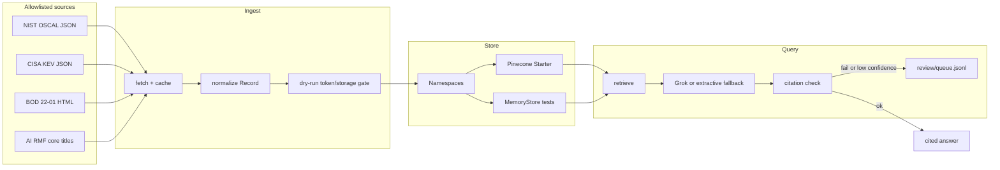

# Architecture

## Record

One vector per control statement, assessment block, baseline summary, KEV row, or directive. Chunking follows **control boundaries**, not arbitrary token windows.

Metadata: `framework`, `control_id`, `family`, `version`, `kind`, `source_url`, `related_ids`, `in_low` / `in_moderate` / `in_high` / `in_privacy`.

## Namespaces

Logical isolation inside one serverless index (`public-control-atlas`, AWS us-east-1, integrated `llama-text-embed-v2`). Starter allows 100 namespaces; Wave 1+2 use twelve.

## Answer contract

Grok sees only retrieved passages that lexically support the question (control IDs, out-of-scope cues, token overlap). Output must be JSON. `validate_answer` drops citations that are not in that set, refuses invented identifiers and lightly-overlapping answer text, and extractive mode refuses when the top hit is about something else. `atlas eval` fails if `must_refuse` items are answered. Review records store a question hash, not the question text.

## Offline path

CI and `pytest` never call Pinecone or xAI. `MemoryStore` scores lexical overlap. Without `XAI_API_KEY`, answers are extractive quotes of the top hit so the CLI remains usable.
